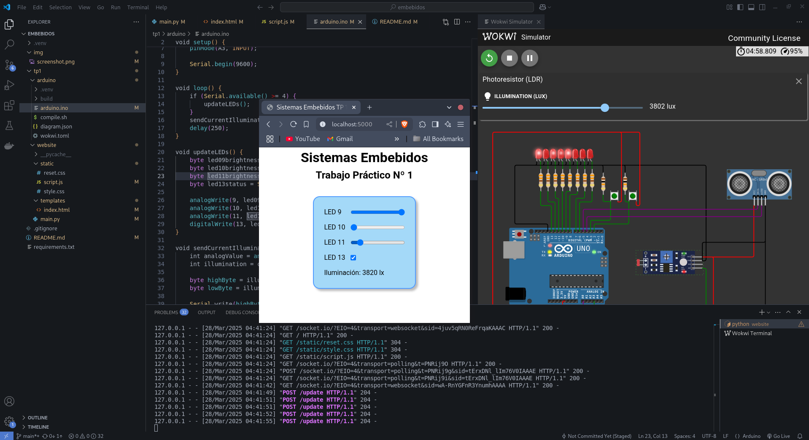

# Sistemas Embebidos

## Requerimientos

- VSCode

- Extensión Wokwi Simulator para VSCode [Link](https://marketplace.visualstudio.com/items?itemName=wokwi.wokwi-vscode)
    
    Después de instalarla, hay que apretar `F1` en VSCode y buscar la opción "Wokwi: Request New License". Se abrirá un navegador y hacemos click en "Get Your License". Tal vez haya que iniciar sesión.

- Arduino IDE o cualquier otro editor de Arduino

- Arduino CLI y config de la placa
    ```bash
    curl -fsSL https://raw.githubusercontent.com/arduino/arduino-cli/master/install.sh | BINDIR=~/.local/bin sh
    arduino-cli core install arduino:avr
    ```

- Python venv

    Revisar si está instalado con `python3 -m venv`. Si no, instalarlo con pip o apt.


## Cómo usar el entorno de desarrollo

Clonar el repositorio.

```bash
clone git@github.com:gonza2323/sistemas-embebidos
```

Ir al directorio del repositorio, crear un entorno virtual y activarlo.

```bash
cd sistemas-embebidos
python3 -m venv .venv
source .venv/bin/activate
```

Si funcionó, ahora debería aparecer `(.venv)` en el prompt.

Dentro del entorno, instalar los requerimientos:

```bash
pip install -r requirements.txt
```

### Usar el simulador

El simulador no arranca si no está compilado el programa de Arduino. Para ello, vamos al directorio de un trabajo práctico, luego a la carpeta `arduino`, y ejecutamos el script `compile.sh` para compilar:

```bash
./compile.sh
```

Para que funcione, el programa del Arduino (arduino.ino) debe estar en esa misma carpeta. El programa compilado debería aparecer en el directorio `build`.

Si hay problemas de permisos, ejecutar `chmod +x compile.sh`.

Ahora sí podemos arrancar el simulador en VSCode apretando `F1` o `Shift`+`Ctrl`+`P` y buscando la opción Wokwi: Start Simulator.

**La simulación debe estar visible para que no se detenga, conviene colocarla como una nueva pestaña a un costado en el VSCode.**


### Arrancar el servidor web

El servidor tal vez crashea si no está andando el simulador al mismo tiempo. Ya lo voy a arreglar para que no pase.

Ir a la carpeta `website` de algún trabajo práctico y ejecutar (con el entorno virtual de Python activado):

```bash
flask --app main.py run
```

O, si queremos que la página se auto refresque cuando hagamos cambios en el código, usamos:
```bash
python3 main.py
```

## Prueba

En la página web para el TP1, apretar el checkbox del LED 13 debería cambiar el estado del LED 13 en la simulación.


