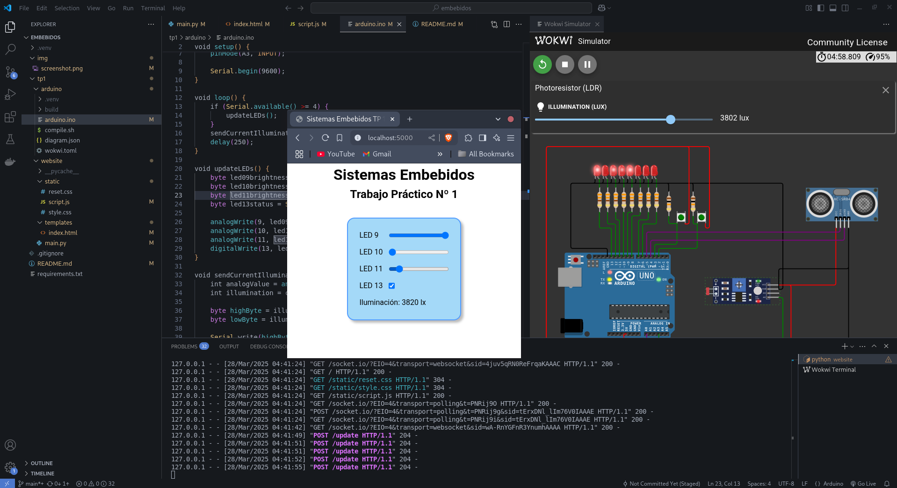

# Sistemas Embebidos

## Trabajo Práctico

## Requerimientos

- Python3

- (Opcional) VSCode y Extensión Wokwi Simulator para VSCode [Link](https://marketplace.visualstudio.com/items?itemName=wokwi.wokwi-vscode). Esto es si queremos simular el Arduino y no utilizar una placa Arduino real.
    
    Después de instalarla, hay que apretar `F1` en VSCode y buscar la opción "Wokwi: Request New License". Se abrirá un navegador y hacemos click en "Get Your License". Requiere registrarse e iniciar sesión.

- Arduino CLI y config de la placa (o Arduino IDE) para compilar y cargar los programas de Arduino.

- Python venv


## Cómo ejecutar un trabajo práctico

Dentro del directorio del TP, crear un entorno virtual y activarlo.

```bash
cd tp3
python3 -m venv .venv
source .venv/bin/activate
```

Dentro del entorno, instalar los requerimientos de Python:

```bash
pip install -r requirements.txt
```

Una vez instalados los requerimientos, tenemos dos opciones para ejecutar la aplicación. Conectando una placa Arduino a la PC, o utilizando el simulador Wokwi para Arduino.


### A) Usando la placa Arduino

Hay que ejecutar el script de setup al menos una vez. El mismo instala arduino-cli, la configuración de la placa, y configura los permisos correctamente para que el usuario pueda acceder al puerto serial. El script también permitirá la desconexión y reconexión sencilla del Arduino.  Este paso solo es necesario una vez, y no es necesario repetirlo para cada trabajo práctico.

```bash
./arduino_setup.sh
```

Para ejecutar un TP, primero debe conectarse la placa por USB. Luego podemos ejecutar el script `./upload.sh` para compilar y cargar el programa a la placa.

Si hay problemas de permisos para acceder al Arduino, es porque nunca se ejecutó el script `./arduino_setup.sh`. Otra opción es configurarlos manualmente.


### B) Usando el simulador de Arduino

El simulador no arranca si no está compilado el programa de Arduino. Para ello, ejecutamos el script `./compile`.

Ahora sí, podemos arrancar el simulador en VSCode apretando `F1` o `Shift`+`Ctrl`+`P` y buscando la opción "Wokwi: Start Simulator". Seleccionamos la única configuración, ubicada en `arduino/wokwi.toml`.

**La simulación debe estar visible para que no se detenga, conviene colocarla como una nueva pestaña a un costado en el VSCode.**


### Arrancar el servidor web

Para arrancar el servidor web, tenemos varias opciones:

```
# con un script de utilidad (utiliza flask)
./start_server

# directamente con Python
python3 website/main.py

# con flask
flask --app website/main.py run
```

Una vez andando el servidor, se puede acceder a la página en http://localhost:5000

Se puede setear la variable de entorno `DEBUG_SERIAL=1` para obtener logs de debugging de la conexión serial. Si ejecutamos con flask o el script, el flag `--debug` también activará el debugging de la conexión serial.

El servidor funciona tanto con la placa Arduino como con el simulador Wokwi. Si se pierde la conexión, intenta restablecerla con cualquiera de los dos que se encuentre disponible. Si ambos están disponibles, dará prioridad a la placa.

## Prueba

En la página web para el TP1, deberían funcionar los controles de los LEDs tanto en el simulador como en la placa Arduino. Lo mismo para la lectura de la simulación.




## Aclaración TP Integrador

El Trabajo Práctico Integrador requiere el uso de https para poder acceder al micrófono y al sensor de iluminación ambiente. Normalmente, localhost sería una excepción, pero como la página está hecha principalmente para ser accedida desde móviles, la dirección no será localhost.

Si la red no cuenta con ip pública o no se tiene control de la misma para abrir y direccionar puertos, no se podrá apuntar un nombre de dominio al servidor para configurar https.

Una opción es crear un túnel SSH reverso desde la computadora donde se hosteará el servidor, hacia un servidor externo que funcione como proxy (puede usarse Nginx). Luego se apunta un nombre de dominio a tal proxy, y se obtienen los certificados correspondientes, para así poder acceder a la página mediante https.
